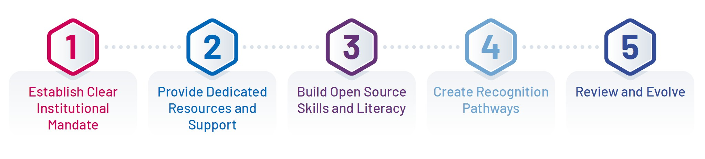
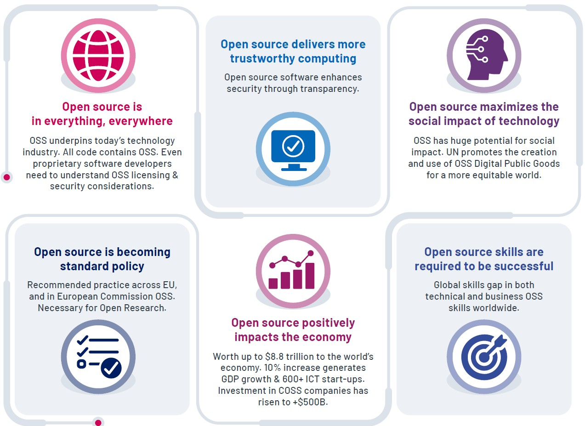
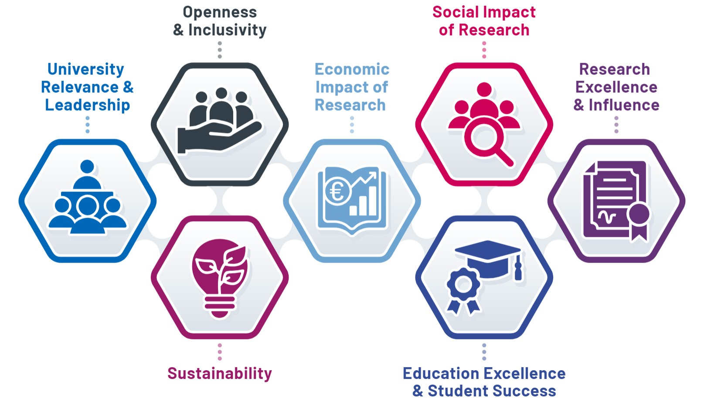
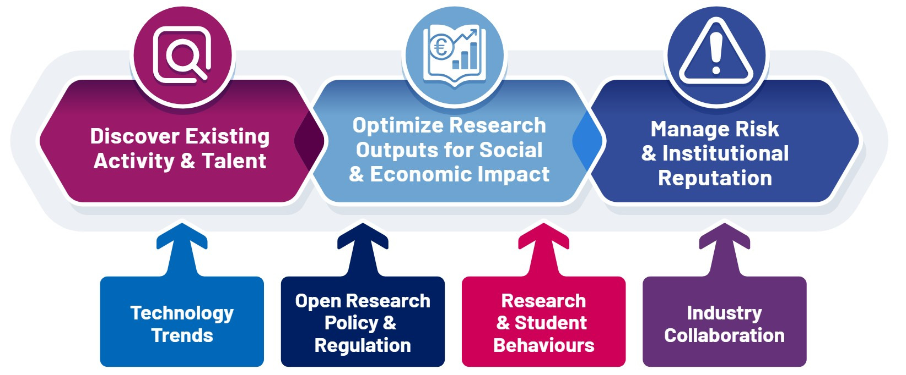
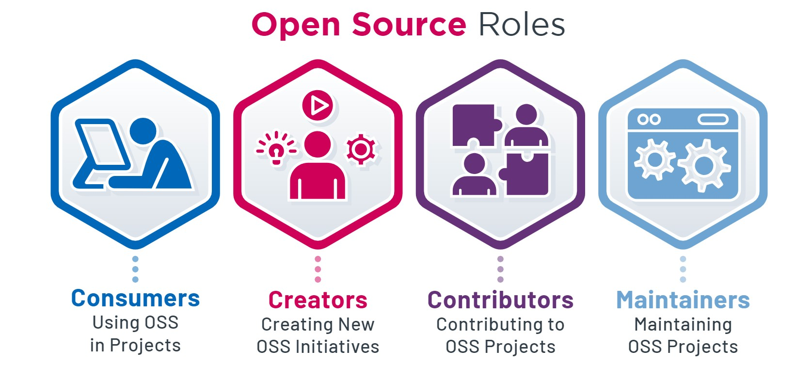

---
title: "Framework for Managing University Open Source Software"
subtitle: "An Initiative to Manage OpenSource Software in Irish Universities (MOSS-I)"
author:
- name: Aoife Tierney
  affiliation: 1
  orcid: 0009-0009-8699-7043
- name: Carlos Tighe
  affiliation: 2,3
  orcid: 0000-0002-5934-9552
- name: Clare Dillon
  affiliation: 2,4
  orcid: 0009-0008-6205-0296
- name: Conor Morris 
  affiliation: 5
- name: Ian Gallivan
  affiliation: 2
  orcid: 0009-0004-5774-3857
- name: Kevin Moerman
  affiliation: 2,4
  orcid: 0000-0003-3768-4269
- name: Lorraine Morgan
  affiliation: 2,4
  orcid: 0000-0002-3803-544X
- name: Martina Prendergast
  affiliation: 4,5
  orcid: 0009-0009-0848-7638
- name: Michael Meagher
  affiliation: 5
  orcid: 0009-0005-0804-8142
- name: Noel O'Connor
  affiliation: 6
  orcid: 0000-0002-4033-9135
- name: Patrick Healy
  affiliation: 4,5
  orcid: 0000-0002-3824-7442
affiliations:
  - index: 1
    name: Trinity College Dublin
  - index: 2
    name: University of Galway
  - index: 3
    name: Insight Centre
  - index: 4
    name: LERO, the SFI Centre for Software Research
  - index: 5
    name: University of Limerick
  - index: 6
    name: Dublin City University
header-right: "v1.0"
subject: "Open Source Software, Irish Universities"
keywords: [Open source, Irish Universities]
lang: "en"
toc: true,
toc-own-page: true,
titlepage: true,
titlepage-rule-color: "360049"
titlepage-text-color: "FFFFFF"
titlepage-background: "assets/backgrounds/FrontCover_plain.pdf"
endpage: "assets/backgrounds/BackCover.pdf"
bibliograpy: "bibliography.bib"
biblio-title: "References"
biblatex: false,
doi: "10.5281/zenodo.3235286"
colorlinks: true,
orcidicon: "assets/images/icons/ORCID-iD_icon_16x16.png"
license_text: "CC BY 4.0"
license_link: "https://creativecommons.org/licenses/by/4.0/"
...

# Introduction

> “Open source is present everywhere. All around the world, companies and public services are using the open source collaborative methods
> to innovate and build new solutions. It powers the cloud and provides professional tools for big data and for information and knowledge management.
> It is in supercomputers, blockchain, the internet of things and artificial intelligence. It is in the internet. It is in our phones and our TVs.
> It provides us with streaming media. It is in our cars. It runs Europe’s air traffic control. The chances are that, in any new project involving software, 
> from kitchen appliances, through web-based public services to highly specialised industrial tools, most of the code will be based on open source.”
>
> – European Commission Open Source Strategy 2020-2023 

Open Source Software (OSS) is the foundation of today’s digital economy, powering critical innovations across industries, from artificial intelligence and quantum computing to cloud technologies and data analytics. For universities, OSS offers a strategic opportunity to enhance research capabilities, accelerate technological advancements, and enable valuable knowledge transfer that collectively generates both economic and social impact. This is particularly relevant in the Irish university sector, where fostering knowledge transfer and innovation can have a direct impact on national economic growth.

In today’s technology landscape, enabling responsible open source practices is not a trivial undertaking. The choice between open source and proprietary software is not a simple "either-or" decision. Most modern systems are a blend of both, with organisations leveraging the strengths of each to meet their goals. The real challenge—and skill— for all those operating in an academic context lies in understanding when to use or create OSS and when proprietary solutions may be more appropriate. Success comes from managing this combination responsibly, balancing transparency, innovation, and control to ensure security, scalability, and sustainability while addressing institutional and individual goals.

This document serves as a comprehensive guide for universities looking to develop or refine an open source software framework. It provides the foundational knowledge and tools needed to create an environment that supports open source that is aligned with the unique needs and goals of each institution.

# Key Recommendations
  
 
1. Establish clear mandate for an open source framework for faculty, staff and students.  
2. Provide dedicated resources and support services to establish and implement the open source framework.  
3. Build open source skills and literacy across the institution.  
4. Create pathways for recognition of open source contributions and impact.  
5. Review and evolve the open source framework over time.

# What Is Open Source?

Open source software (OSS) refers to software with source code that is made publicly available under a license that allows anyone to view, use, modify, and distribute the software for any purpose. Open source software is powerful because it lowers barriers to technology adoption, enabling innovation, flexibility, and customisation while providing transparent, secure, and efficient solutions. In its most basic form, open-sourcing your software means putting your code online with an open source license where it can be viewed and reused by others. More details can be found in the Open Source Initiative’s [Open Source Definition](https://opensource.org/osd) [@OSI_1].

Open Source Hardware is also an important topic with related opportunities and challenges, but for the purposes of this document we are focusing on open source software. 

# Why Is Open Source So Important?

**Open source is in everything, everywhere**. Open source enables the frictionless reuse of software. As a result, it is used everywhere. The majority of the code in all code bases is open source  [@OSSRA_1]. Therefore, even if a project isn’t intended to be open source, it’s crucial to understand the risks, obligations, and security considerations that come with adopting open source projects to ensure responsible use and compliance. Understanding OSS adoption is essential for maintaining secure and efficient software ecosystems.

**Open source positively impacts the economy.** Recent research shows that open source software is worth up to \$8.8 trillion to the world’s economy [@hoffmann_value_2024]. Additional research from the European Commission predicted that an increase of 10\% in contributions to Open Source Software code would annually generate an additional 0.4\% to 0.6\% GDP, as well as more than 600 additional ICT start-ups in the EU [@EU_1]. OSS may be free to view, use, modify, and distribute, but it is not necessarily free of cost. We have seen a significant rise in the number of Commercial Open Source Software (COSS) companies that offer open source software, but monetise their offerings by providing value-added services such as professional support, consulting, training, and premium features. Investment in COSS companies has risen to \$500B and the growth of COSS companies has been faster than that of companies with proprietary source code at their core [@COSS_1].

**Open source maximises the social impact of technology**. The UN and other organisations have acknowledged the huge potential for social impact related to investments in open source, giving the global south immediate and unrestricted access to the latest research innovation. They promote the creation and use of open source Digital Public Goods for a more equitable world [@UN_1].

**Open source is becoming standard policy**. Throughout the world, open source is becoming a recommended practice for those building software. Europe has had active engagement in shaping open source policies and leveraging them in strategic areas like AI [@EU_2]. The European Union directive on government use of FOSS was adopted in 2009. The European Commission’s first strategy for open source was adopted in 2000 [@EU_3]. In 2020, the European Commission approved its new Open Source Software Strategy 2020-2023 of the Commission [@EU_4]. It promotes the sharing and reuse of software solutions, knowledge and expertise, to deliver better European services that benefit society and lower costs to that society. Organisations such as UNESCO, European Commission, and the US National Academies of Sciences, Engineering and Medicine all have recommendations stating that open source is a primary requirement for open science and open research [@UNESCO_1; @EU_5]. 

**Open source delivers more trustworthy computing.** Open source software enhances security through transparency. With open access to the source code, many developers and users can inspect, audit, and identify potential vulnerabilities. The principle of "many eyes make all bugs shallow" means that issues are often discovered and addressed faster than in closed systems. Furthermore, in a time where mistrust in formal institutions is growing, open source fosters trust with end users by offering full visibility into how the technology works, removing the uncertainty often associated with proprietary solutions. This transparency helps ensure that users can rely on the integrity and security of their systems.

**Open source skills are required to be successful.** Leveraging the opportunities related to open source requires a unique set of skills. Building these skills is crucial to foster a successful modern software development environment. These skills include technical skills and strong collaboration skills to navigate diverse and often decentralised team dynamics. Other roles within the software ecosystem—such as legal and business professionals—must also develop specialised skills. Legal experts need to understand various open source licenses and their implications for intellectual property and compliance. Business professionals must learn how to leverage open source for strategic advantage, such as fostering innovation, reducing costs, and engaging with developer communities. There is a recognised gap in all these skills globally [@OIN_1].

# Addressing Open Source Myths

1. **Open source is not just for hobbyists.** These days, open source is no longer the domain of hobbyist developers working alone. It is estimated that over 90% of all the world’s software is open source code. Most of the world’s largest organisations adopt, create and contribute to open source with professional developers in all domains using open source to collaborate with their innovation partners. Often organisations invest in Open Source Program Offices (OSPOs) to manage their open source use and contributions.  
2. **You retain IP and copyright**. It is important to note that open source licensing does not relinquish intellectual property (IP) rights. The original creator or contributors still retain IP ownership, and the license merely governs how others can interact with the project. This control ensures that while the code is freely accessible, the rights of the creators are respected, allowing them to define how their work is used or credited in derivative projects.   
3. **You can commercialise open source software.** Many open source projects lead to the creation of commercial open source software (COSS) companies, which monetise through services and support, a growing trend in the tech industry.  
4. **Open source is as secure as proprietary software**. OSS is often now considered to be as secure or even more secure than proprietary software [@LINUX_1]. The security of both depends on the quality of the software and the software development process. However, unlike proprietary software, where security issues can remain hidden, open source benefits from transparent review processes, which lead to faster detection and resolution of security flaws.

# Open Source In Academia

## Why Is Open Source Important In An Academic Context?

## University Relevance & Leadership

**Open Source Provides New Opportunities for University Leadership.** Excellence in open source enables universities to accelerate the impact of research and attract top-tier talent. A proactive approach to open source positions an institution as a global leader, capable of shaping the future of research and education through widespread dissemination and application of software research outputs.  
**Open Source Aligns with Global Best Practices.** Integrating open source software and practices into research and education builds the skills necessary to engage with the broader open source ecosystem. In this way, universities can demonstrate their alignment with software development best practices and their commitment to transparency, effective industry collaboration, and cutting-edge research. 

## Research Excellence & Influence

**Open source Enables Open Research Excellence.** Open source software and tools form a critical part of Open Research practices. Open data published without related source code hampers open research by limiting transparency, reproducibility, and collaboration. To enable the Open Research principles, it is essential that we build open source capacity and competencies within the researcher community.  
**Open Source Increases Researcher Influence.** Taking an open source approach can accelerate the pace of innovation around a particular domain, and dictate market trends. As a result, open source contributions can also enhance researchers’ and institutions’ reputations and influence in their field, demonstrating impact through the widespread dissemination and application of their work.

## Research Impact \- Commercialisation

**Open Source Increases Spin-out Opportunities.** There is a rise in investment and growth of Commercial Open Source Software (COSS) companies. Facilitating the spin-out of COSS companies alongside traditional companies based on proprietary source code increases the opportunities for commercialisation of research.  
**Open Source Improves Industry Collaboration.** With the rise of corporate open source investment, many organisations are now funding academic research with the explicit ask for open source output. This has been proven to accelerate the adoption and impact of funded research. 

## Research Impact \- Social & Economic

**Open Source Increases Economic Impact.** Apart from short-term commercialisation opportunities, making research software available as open source has the potential to deliver additional indirect economic impact for a university, through accelerated innovation and the potential for hubs of start-up activity that can evolve around open source projects.  
**Open Source Delivers Social Impact.** Universities care about the positive impact they have on the world around them. The UN explicitly recommends digital public goods be made available as open source. Open source projects from universities can contribute to social impact across a wide range of areas, ranging from healthcare and agriculture to urban planning and policy analysis. 

## Education Excellence & Student Success

**Open Source Enables Hands-on Learning.** By engaging with open source projects, students gain real-world practical experience in their field of study, learn collaboration and problem-solving skills. The focus on mentorship within open source communities provides additional learning opportunities, personalised guidance, and peer support.  
**Open Source Increases Employability.** As open source makes up most of the world’s software today, skills related to the use, contribution to, creation of, and maintenance of open source are in high demand in industry.  Open source contributions provide real-world evidence of skills valued by recruiters. Universities that help students build open source skills prepare them for future careers in real-world software development environments. 

## Openness & Inclusivity

**Open Source Democratises Education.** Open source promotes the democratisation of education by making knowledge and educational tools accessible to a wider audience, including underrepresented and marginalised communities. Moreover, collaborating on open source courseware allows institutions to develop best-in-class material and keep it fresh with input from a diverse range of contributors and subject matter experts.  
**Open Source Builds Inclusive Communities.** Open source projects foster a sense of community and belonging among contributors, who work together towards common goals, increasing feelings of connection, building networks, and ultimately resulting in more meaningful work. Because it is accessible to all, it enables contributions and collaboration with individuals from diverse backgrounds. 

## Sustainability

Sustainability can mean many things. Open source forms the basis of many software projects focused on tackling climate change. Open source can also help make all the software we build more environmentally sustainable. Building an open source community around a project can help ensure software projects themselves are sustained over time.

**Open Source Helps Address Climate Change.** The UN has published information on the critical role of open source in dealing with our climate challenges [@UNEPFI_1]. Open source software can also contribute to the environmental sustainability of the broader technology industry by optimising resource use and reducing waste through shared services and infrastructure.  
**Open Source Increases Long-term Project Viability.** Open source projects often have active communities dedicated to their maintenance and development, ensuring that educational and research tools remain up-to-date and viable over the long term.

# Why An Open Source Framework Is Essential For Universities

In today's digital academic landscape, open source software development spans all disciplines, from computer science to the humanities, often occurring without formal governance structures. Increasingly, European regulations, funding programs, and open research guidelines require open software outputs, while industry voices call for more open collaboration opportunities grounded in open source practices [@CURIOSS_1].

Without a structured framework for open source, universities risk losing opportunities to amplify research impact, drive innovation, and showcase institutional excellence. Moreover, the lack of clear guidelines exposes institutions to significant risks, including intellectual property conflicts, security vulnerabilities, and compliance issues stemming from unmanaged open source activities. By adopting a comprehensive framework, universities can transform fragmented open source efforts into strategic assets, aligning institutional goals with best practices.

A well-defined open source framework offers substantial opportunities. Many researchers and students are already successfully using and creating open source in universities today. An open source framework enhances research impact through improved code sharing, fosters stronger industry partnerships through aligned practices, and accelerates the adoption of research outputs. Additionally, it creates pathways for research commercialisation, leveraging the rapidly growing Commercial Open Source Software (COSS) models that attract global investment. Such a framework also supports the recognition and reward of open source contributions that deliver significant social impact.

Unmanaged open source activities present real risks. Without governance, universities remain vulnerable to intellectual property disputes, security risks, and regulatory non-compliance, all of which could harm reputation and incur legal liabilities. Proactively addressing these challenges is critical for protecting institutional interests.

As open source becomes central to open science and research, universities must establish clear policies and procedures for managing it. This is essential not only for staying competitive but also for advancing their academic mission. Globally, institutions are addressing these challenges through initiatives like academic Open Source Program Offices (OSPOs). Ireland has already taken a leadership role by establishing Europe’s first academic OSPO. Building on its uniquely networked academic ecosystem, Ireland has the opportunity to develop coordinated, effective approaches to open source management that can serve as a global model.

# Who Engages With a University Open Source Framework?

There is a diverse set of people who can interact with an OSS framework, including:

- **University Leadership:** leadership support of an OSS framework is essential to ensure that it integrates into strategic planning, academic programs, and operational management along with promoting openness and innovation across the institution.  
- **Researchers**: Open source software is a critical output of research activities. It should be noted that this is not confined to computer science or other technical domains. Open source software is often now produced across all domains including health sciences, arts, and the humanities. Many researchers also contribute to OSS in their own time.   
- **Students**: Students may be asked to use, contribute to or create OSS projects as part of their curricula. Many students also contribute to OSS in their own time or organise hackathons with OSS outputs.  
- **University IT**: Whereas university OSS frameworks typically do not cover procurement within university IT departments, they sometimes can include any supports IT departments may offer staff and students in using or creating OSS, for example provision of code hosting platforms such as GitHub or automated building or testing.   
- **Tech Transfer Office**: OSS strategies can be informed to permit a variety of commercialisation pathways.    
- **Impact Officers**: Those who catalogue/chart University's impact activities have an interest in tracking OSS activity and impact.  
- **University Staff**: Additional university staff are also interested in an institution's OSS framework including those in the Office of the Vice President for Research, Legal Affairs, Technology Transfer Office, Research Support Services, Libraries, and staff involved in innovation activities. These professional support services play crucial roles in enabling and governing open source activities across the institution.

# Open Source Roles in a University Context

It is important to consider that individuals in a university may engage with open source in different ways. An open source framework should address various use cases, acknowledging the challenge posed by varying coding principles and standards of maintainability across different institutions and departments. Any framework should ensure that principles are open for department-specific nuances while emphasising good coding and technology practices. The framework must be flexible enough to accommodate diverse disciplinary contexts, recognising that the needs and technical expertise of researchers in computer science will differ substantially from those in humanities, medicine, or social sciences, while maintaining appropriate standards for each domain.

**Using OSS in Projects ("Consumers")**  
Open source software is widely used by students, researchers, and university staff. Responsible use of OSS requires an understanding of license choices and their implications, especially if the OSS is incorporated into a derivative research output that may later be released. 

**Creating New OSS Initiatives ("Creators")**  
What license should I use? Where should I host my OSS project? Those that are creating open source software often require support and advice on how to do it for maximum impact.

**Contributing to OSS Projects ("Contributors")**  
Often the optimal route to sharing OSS is not creating a new OSS project, but rather contributing source code to an existing project. There are many best practices related to how to engage and contribute to existing OSS projects. 

**Maintaining OSS Projects ("Maintainers")**  
Once an OSS project has been created, it is necessary to consider the goals around project growth and maintenance. If the goal is to maximise community use and engagement, there are many related best practices around fostering inclusive contributions, e.g. providing clear and comprehensive documentation, community management, and project governance.

# Implementing and Open Source Framework

This section outlines the key considerations necessary for fostering effective open source practices within a university. By establishing clear guidelines, policies, or charters, the university can cultivate a culture that leverages open source to enhance research excellence, facilitate knowledge sharing, and foster industry partnerships. A comprehensive framework is critical to balancing openness with governance, ensuring that open source contributions are sustainable, secure, and aligned with the institution's broader objectives.

## What is included in an Open Source framework?

An Open Source Framework tailored for a university can include any combination of policies, charters, and guidelines, depending on the level of formality and governance needed. A policy establishes formal rules and compliance requirements, a charter sets out high-level goals and guiding principles, and guidelines offer practical, detailed advice for day-to-day open source engagement. Together, they form a comprehensive approach to integrating open source into university life.

Here's a breakdown of what might be included in each:

### Open Source Policy

An **Open Source Policy** is a formal, high-level document that outlines the institution's overarching principles, commitments, and regulations regarding the use and development of open source software. It is typically mandatory and governs the university's official stance and actions related to open source. It may be a stand-alone policy document, or an addition to existing policy documents, such as the IP Management or Open Research policy documents. 

**Potential Inclusions:**

* **Commitment to Open Source**: A declaration of the university's dedication to promoting responsible open source usage and contribution.  
* **Licensing and Compliance**: Clear rules regarding the appropriate open source licenses for use and contribution, ensuring compliance with both legal and institutional requirements.  
* **Intellectual Property (IP) Management**: Guidelines on how IP rights are handled in open source projects, balancing openness with IP protection.  
* **Security and Risk Management**: Procedures for auditing and addressing vulnerabilities in open source projects used or created within the university.  
* **Contribution Requirements**: Rules governing how faculty, students, and staff can contribute to external open source projects, ensuring their work aligns with university values and IP policies.

### Open Source Charter

An **Open Source Charter** is a less formal document than a policy and is typically used to define a specific mission or set of principles for engaging with open source within certain parts of the university, such as a department, research group, or student body. A charter outlines aspirational goals and guiding principles, providing flexibility and a focus on collaboration.

**Potential Inclusions:**

* **Vision and Objectives**: An outline of the university’s or department’s long-term goals for OSS involvement, including fostering innovation, education, and community engagement.  
* **Community and Collaboration**: Encouragement for open collaboration within academic and external communities, providing guidance on participation in open source projects and community-building initiatives.  
* **Principles of Openness**: Emphasis on transparency, inclusivity, and open access to research and educational tools.  
* **Project Governance**: Guidelines for how open source projects are managed, including decision-making processes, project leadership, and roles within the university’s open source ecosystem.  
* **Support for Contributions**: Encouragement for faculty, staff, and students to contribute to open source projects, both internally and externally, and recognition of their contributions in academic and professional evaluations.

### Open Source Guidelines

**Open Source Guidelines** are the most flexible and practical element of a framework. They provide detailed, actionable instructions on how to use, develop, and contribute to open source within the university context. Guidelines are often updated frequently to reflect best practices and new developments.

**Potential Inclusions:**

* **Best Practices for Using Open Source**: Practical advice on how to select, adopt, and use open source software in academic projects and institutional IT environments.  
* **Licensing Choices**: Guidance on how to choose appropriate open source licenses for university projects, ensuring compatibility with project goals and compliance with institutional policies.  
* **Contributing to Open Source**: Steps for contributing code to external open source projects, including how to attribute university affiliation and how to ensure compliance with open source licenses.  
* **Creating and Publishing Open Source**: Detailed instructions on how to start, manage, and publish new open source projects, including recommendations on repositories (e.g., GitHub), code maintenance, and community engagement.  
* **Security and Code Quality**: Recommendations for secure coding practices and conducting security audits for open source projects, as well as maintaining code quality through peer reviews and automated testing.  
* **Ensuring Open Source Sustainability**: Best practices for maintaining the long-term viability of open source projects, including creating a clear governance structure, fostering an active contributor community, securing funding or institutional support, and implementing processes for ongoing maintenance, documentation, and user engagement.  
* **Education and Training**: Resources and training programs to help faculty, staff, and students improve their open source skills, covering areas like collaborative development, code versioning, and compliance with licenses.

## Approach to Implementing an Open Source Framework

The implementation of an open source framework must be tailored to each institution's unique culture, existing policies, and strategic objectives. While some universities may require comprehensive formal policies from the outset, others might benefit from starting with lightweight guidelines that can evolve over time. Research-intensive institutions might prioritise frameworks that support complex research software projects, while institutions focused on teaching might emphasise student engagement and learning opportunities. The following set of steps represents **one possible approach** to implementing an open source framework, which can be adapted based on institutional context and needs.

1. **Establish Clear Institutional Mandate**  
* Develop formal documentation that explicitly supports OSS activities, integrated with existing research and IP policies  
* Create clear guidance on roles and responsibilities for OSS management across departments  
* Ensure leadership visibly champions OSS initiatives through strategic plans and public commitments  
2. **Provide Dedicated Resources and Support**  
* Establish a coordinating body (such as a university Open Source Program Office [@young_definition_2024]) to oversee framework development and implementation  
* Allocate specific budget and staff resources for OSS support services including legal expertise and technical guidance  
* Create centralised resources potentially including documentation, tools, and platforms for OSS development and hosting  
3. **Build Open Source Skills and Literacy**  
* Develop training programs tailored to different roles and disciplines, from basic OSS concepts to advanced development practices  
* Integrate OSS practices into relevant curricula and research methodologies across departments  
* Create mentorship programs pairing experienced OSS contributors with newcomers  
4. **Create Recognition Pathways**  
* Establish metrics and processes for tracking OSS contributions and impact  
* Include OSS outputs in research assessment frameworks and academic evaluations  
* Develop rewards and incentives for significant OSS contributions, such as consideration in promotion and tenure decisions  
5. **Review and Evolve**  
* Schedule regular framework reviews to assess effectiveness and identify areas for improvement  
* Gather feedback from all stakeholder groups to ensure the framework continues to meet their needs  
* Monitor global trends in open source and academic practices to maintain framework relevance  
* Update policies, guidelines, and support resources based on lessons learned and emerging best practices

# Conclusion

The establishment of an open source framework is pivotal for universities aiming to align with global best practices, foster innovation, and maximise the impact of their research and educational activities. By implementing the recommended steps—such as establishing a clear institutional mandate, providing dedicated resources, building open source literacy, creating recognition pathways, and committing to ongoing review and evolution—universities can strategically harness the benefits of open source while mitigating associated risks. These measures ensure that open source practices are sustainable, secure, and fully integrated into the institution’s operations and goals. As open source becomes a cornerstone of modern academic and industry practices, universities equipped with such frameworks are well-positioned to lead innovation, drive societal impact, and ensure long-term competitiveness in the digital economy.

## Recommendations for Future NORF Projects

1. **Apply the Framework in Irish Universities**  
   Pilot the implementation of the recommended open source framework in one or more Irish universities, leveraging Ireland’s leadership in establishing Europe’s first academic Open Source Program Office (OSPO). These pilots could focus on integrating open source principles into strategic planning, research, and teaching while showcasing how the framework can amplify research impact, foster industry partnerships, and enhance sustainability efforts. This would allow for the validation of its effectiveness, the collection of practical feedback, and the refinement of the framework for broader implementation.   
2. **Build Open Source Skills**  
   Build on other NORF projects such as TROPIC [@lakhzoum_norf_2023] to collaboratively develop tailored training programs for Irish universities that address diverse disciplines and include both technical and non-technical open source skills. A priority area identified by MOSS-I participants is open source licensing. Related skills should be integrated into programs overseen by the Vice President of Research and/or Technology Transfer Offices.   
3. **Establish an MVP for University OSPO**  
   Develop a set of requirements and guidelines for establishing a minimum viable Open Source Program Office (OSPO) that would support an Irish university. This would provide Irish universities with a clear roadmap for creating OSPOs that meet their specific needs, thereby enhancing their ability to manage OSS, drive innovation, and support collaboration.  
4. **Foster Industry Collaboration**  
   Provide guidelines and collaboration patterns on how to best co-create open source projects that involve academia and industry partners. Focus on examples that align with market trends and address real-world challenges, increasing research adoption and employability for students.  
5. **Develop Metrics and Recognition**  
   Implement advanced metrics to identify open source contributions and propose how Irish universities might recognise impactful work.  
6. **Engage in Global Networking**  
   Engage with international academic OSPOs to share best practices, collaborate on large-scale open source projects, and contribute to global standards for research and education.

# Acknowledgments

This document was an output from the [Lero's MOSS-I project](https://sfi-lero.github.io/OSPO/projects/moss-i/) and was funded by the National Open Research Forum (NORF). For more information about NORF and its initiatives, please visit the NORF website: [www.norf.ie](www.norf.ie).

The authors would also like to thank the following members of the Irish academic community, who provided invaluable feedback and contributions to the MOSS-I project:

* **Dermot Lynott**, Maynooth University  
* **Dounia Lakhzoum**, Maynooth University  
* **Catherine Hurley**, Maynooth University  
* **Carlos Tighe**, University of Galway  
* **Barak Pearlmutter**, Maynooth University  
* **Felipe Arruda Pontes**, University of Galway  
* **Puneet Saidha**, University of Limerick  
* **Samantha Williams**, Trinity College Dublin  
* **Anthony Morrissey**, University College Cork  
* **James O'Sullivan**, South East Technological University  
* **Jen Smith**, University of Galway  
* **Armin Straube**, University of Limerick  
* **Niamh Brennan**, Trinity College Dublin  
* **Oksana Dereza**, University of Galway

\newpage
# References
