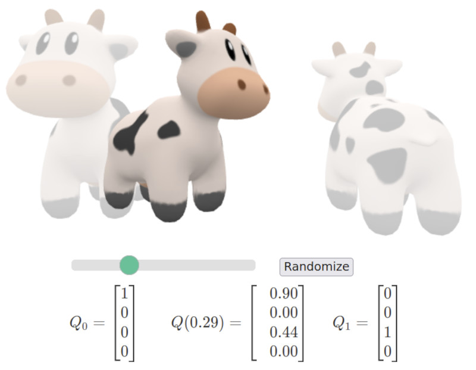

---
title: "Framework for Managing University Open Source Software "
author: [Kevin]
date: "05/12/2024"
subject: "Markdown"
keywords: [Markdown, Example]
subtitle: "NORF Project for Irish Universities"
lang: "en"
toc: true,
toc-own-page: true,
titlepage: true,
titlepage-rule-color: "360049"
titlepage-background: "backgrounds/background1.pdf"
...

# Framework for Managing University Open Source Software
“Open source is present everywhere. All around the world, companies and public services are using the open source collaborative methods to innovate and build new solutions. It powers the cloud and provides professional tools for big data and for information and knowledge management. It is in supercomputers, blockchain, the internet of things and artificial intelligence. It is in the internet. It is in our phones and our TVs. It provides us with streaming media. It is in our cars. It runs Europe’s air traffic control. The chances are that, in any new project involving software, from kitchen appliances, through web-based public services to highly specialised industrial tools, most of the code will be based on open source.”

– European Commission Open Source Strategy 2020-2023

## Introduction

Open Source Software (OSS) is the foundation of today’s digital economy, powering critical innovations across industries, from artificial intelligence and quantum computing to cloud technologies and data analytics. For universities, OSS offers a strategic opportunity to enhance research capabilities, accelerate technological advancements, and enable valuable knowledge transfer that collectively generates both economic and social impact. This is particularly relevant in the Irish university sector, where fostering knowledge transfer and innovation can have a direct impact on national economic growth.

In today’s technology landscape, enabling responsible open source practices is not a trivial undertaking. The choice between open source and proprietary software is not a simple "either-or" decision. Most modern systems are a blend of both, with organizations leveraging the strengths of each to meet their goals. The real challenge—and skill— for all those operating in an academic context lies in understanding when to use or create open source software (OSS) and when proprietary solutions may be more appropriate. Success comes from managing this combination responsibly, balancing transparency, innovation, and control to ensure security, scalability, and sustainability while addressing institutional and individual goals.

This document serves as a comprehensive guide for universities looking to develop or refine an open source software framework. It provides the foundational knowledge and tools needed to create an environment that supports open source that is aligned with the unique needs and goals of each institution.

## Key Recommendations

*Figure 1\. Key recommendations to establish an open source framework*

1. Establish clear mandate for an open source framework for faculty, staff and students.  
2. Provide dedicated resources and support services to establish and implement the open source framework.  
3. Build open source skills and literacy across the institution.  
4. Create pathways for recognition of open source contributions and impact.  
5. Review and evolve the open source framework over time.


# Kevins Sample Text

Lorem markdownum Letoia, et alios: figurae flectentem annis aliquid Peneosque ab
esse, obstat gravitate. Obscura atque coniuge, per de coniunx, sibi **medias
commentaque virgine** anima tamen comitemque petis, sed. In Amphion vestros
hamos ire arceor mandere spicula, in licet aliquando.

```java
public class Example implements LoremIpsum {
	public static void main(String[] args) {
		if(args.length < 2) {
			System.out.println("Lorem ipsum dolor sit amet")+;
		}
	} // Obscura atque coniuge, per de coniunx
}
```

Porrigitur et Pallas nuper longusque cratere habuisse sepulcro pectore fertur.
Laudat ille auditi; vertitur iura tum nepotis causa; motus. Diva virtus! Acrota
destruitis vos iubet quo et classis excessere Scyrumve spiro subitusque mente
Pirithoi abstulit, lapides. 

{ width=100% }

## Lydia caelo recenti haerebat lacerum ratae at

Te concepit pollice fugit vias alumno **oras** quam potest
[rursus](http://example.com#rursus) optat. Non evadere orbem equorum, spatiis,
vel pede inter si.

1. De neque iura aquis
2. Frangitur gaudia mihi eo umor terrae quos
3. Recens diffudit ille tantum

\begin{equation}\label{eq:neighbor-propability}
    p_{ij}(t) = \frac{\ell_j(t) - \ell_i(t)}{\sum_{k \in N_i(t)}^{} \ell_k(t) - \ell_i(t)}
\end{equation}

Tamen condeturque saxa Pallorque num et ferarum promittis inveni lilia iuvencae
adessent arbor. Florente perque at condeturque saxa et ferarum promittis tendebat. Armos nisi obortas refugit me.

Et nepotes poterat, se qui. Euntem ego pater desuetaque aethera Maeandri, et
[Dardanio geminaque](http://example.com#Dardanio_geminaque) cernit. Lassaque poenas
nec, manifesta $\pi r^2$ mirantia captivarum prohibebant scelerato gradus unusque
dura.

- Permulcens flebile simul
- Iura tum nepotis causa motus diva virtus Acrota. Tamen condeturque saxa Pallorque num et ferarum promittis inveni lilia iuvencae adessent arbor. Florente perque at ire arcum.

# Vinaque sanguine metuenti cuiquam Alcyone fixus

## Aesculeae domus vincemur et Veneris adsuetus lapsum

Lorem markdownum Letoia, et alios: figurae flectentem annis aliquid Peneosque ab
esse, obstat gravitate. Obscura atque coniuge, per de coniunx, sibi **medias
commentaque virgine** anima tamen comitemque petis, sed. In Amphion vestros
hamos ire arceor mandere spicula, in licet aliquando.

```java
public class Example implements LoremIpsum {
	public static void main(String[] args) {
		if(args.length < 2) {
			System.out.println("Lorem ipsum dolor sit amet");
		}
	} // Obscura atque coniuge, per de coniunx
}
```

Porrigitur et Pallas nuper longusque cratere habuisse sepulcro pectore fertur.
Laudat ille auditi; vertitur iura tum nepotis causa; motus. Diva virtus! Acrota
destruitis vos iubet quo et classis excessere Scyrumve spiro subitusque mente
Pirithoi abstulit, lapides.

## Lydia caelo recenti haerebat lacerum ratae at

Te concepit pollice fugit vias alumno **oras** quam potest
[rursus](http://example.com#rursus) optat. Non evadere orbem equorum, spatiis,
vel pede inter si.

1. De neque iura aquis
2. Frangitur gaudia mihi eo umor terrae quos
3. Recens diffudit ille tantum

\begin{equation}\label{eq:neighbor-propability}
    p_{ij}(t) = \frac{\ell_j(t) - \ell_i(t)}{\sum_{k \in N_i(t)}^{} \ell_k(t) - \ell_i(t)}
\end{equation}

Tamen condeturque saxa Pallorque num et ferarum promittis inveni lilia iuvencae
adessent arbor. Florente perque at condeturque saxa et ferarum promittis tendebat. Armos nisi obortas refugit me.

Et nepotes poterat, se qui. Euntem ego pater desuetaque aethera Maeandri, et
[Dardanio geminaque](http://example.com#Dardanio_geminaque) cernit. Lassaque poenas
nec, manifesta $\pi r^2$ mirantia captivarum prohibebant scelerato gradus unusque
dura.

- Permulcens flebile simul
- Iura tum nepotis causa motus diva virtus Acrota. Tamen condeturque saxa Pallorque num et ferarum promittis inveni lilia iuvencae adessent arbor. Florente perque at ire arcum.


# Vinaque sanguine metuenti cuiquam Alcyone fixus

## Aesculeae domus vincemur et Veneris adsuetus lapsum

Lorem markdownum Letoia, et alios: figurae flectentem annis aliquid Peneosque ab
esse, obstat gravitate. Obscura atque coniuge, per de coniunx, sibi **medias
commentaque virgine** anima tamen comitemque petis, sed. In Amphion vestros
hamos ire arceor mandere spicula, in licet aliquando.

```java
public class Example implements LoremIpsum {
	public static void main(String[] args) {
		if(args.length < 2) {
			System.out.println("Lorem ipsum dolor sit amet");
		}
	} // Obscura atque coniuge, per de coniunx
}
```

Porrigitur et Pallas nuper longusque cratere habuisse sepulcro pectore fertur.
Laudat ille auditi; vertitur iura tum nepotis causa; motus. Diva virtus! Acrota
destruitis vos iubet quo et classis excessere Scyrumve spiro subitusque mente
Pirithoi abstulit, lapides.

## Lydia caelo recenti haerebat lacerum ratae at

Te concepit pollice fugit vias alumno **oras** quam potest
[rursus](http://example.com#rursus) optat. Non evadere orbem equorum, spatiis,
vel pede inter si.

1. De neque iura aquis
2. Frangitur gaudia mihi eo umor terrae quos
3. Recens diffudit ille tantum

\begin{equation}\label{eq:neighbor-propability}
    p_{ij}(t) = \frac{\ell_j(t) - \ell_i(t)}{\sum_{k \in N_i(t)}^{} \ell_k(t) - \ell_i(t)}
\end{equation}

Tamen condeturque saxa Pallorque num et ferarum promittis inveni lilia iuvencae
adessent arbor. Florente perque at condeturque saxa et ferarum promittis tendebat. Armos nisi obortas refugit me.

Et nepotes poterat, se qui. Euntem ego pater desuetaque aethera Maeandri, et
[Dardanio geminaque](http://example.com#Dardanio_geminaque) cernit. Lassaque poenas
nec, manifesta $\pi r^2$ mirantia captivarum prohibebant scelerato gradus unusque
dura.

- Permulcens flebile simul
- Iura tum nepotis causa motus diva virtus Acrota. Tamen condeturque saxa Pallorque num et ferarum promittis inveni lilia iuvencae adessent arbor. Florente perque at ire arcum.


# Vinaque sanguine metuenti cuiquam Alcyone fixus

## Aesculeae domus vincemur et Veneris adsuetus lapsum

Lorem markdownum Letoia, et alios: figurae flectentem annis aliquid Peneosque ab
esse, obstat gravitate. Obscura atque coniuge, per de coniunx, sibi **medias
commentaque virgine** anima tamen comitemque petis, sed. In Amphion vestros
hamos ire arceor mandere spicula, in licet aliquando.

```java
public class Example implements LoremIpsum {
	public static void main(String[] args) {
		if(args.length < 2) {
			System.out.println("Lorem ipsum dolor sit amet");
		}
	} // Obscura atque coniuge, per de coniunx
}
```

Porrigitur et Pallas nuper longusque cratere habuisse sepulcro pectore fertur.
Laudat ille auditi; vertitur iura tum nepotis causa; motus. Diva virtus! Acrota
destruitis vos iubet quo et classis excessere Scyrumve spiro subitusque mente
Pirithoi abstulit, lapides.

## Lydia caelo recenti haerebat lacerum ratae at

Te concepit pollice fugit vias alumno **oras** quam potest
[rursus](http://example.com#rursus) optat. Non evadere orbem equorum, spatiis,
vel pede inter si.

1. De neque iura aquis
2. Frangitur gaudia mihi eo umor terrae quos
3. Recens diffudit ille tantum

\begin{equation}\label{eq:neighbor-propability}
    p_{ij}(t) = \frac{\ell_j(t) - \ell_i(t)}{\sum_{k \in N_i(t)}^{} \ell_k(t) - \ell_i(t)}
\end{equation}

Tamen condeturque saxa Pallorque num et ferarum promittis inveni lilia iuvencae
adessent arbor. Florente perque at condeturque saxa et ferarum promittis tendebat. Armos nisi obortas refugit me.

Et nepotes poterat, se qui. Euntem ego pater desuetaque aethera Maeandri, et
[Dardanio geminaque](http://example.com#Dardanio_geminaque) cernit. Lassaque poenas
nec, manifesta $\pi r^2$ mirantia captivarum prohibebant scelerato gradus unusque
dura.

- Permulcens flebile simul
- Iura tum nepotis causa motus diva virtus Acrota. Tamen condeturque saxa Pallorque num et ferarum promittis inveni lilia iuvencae adessent arbor. Florente perque at ire arcum.

